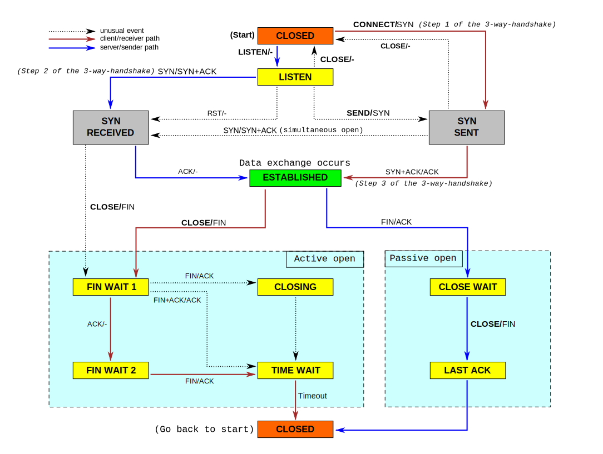

## TCP 상태 다이어그램

위 다이어그램은 TCP 연결에서 클라이언트 혹은 서버가 가질 수 있는 상태를 다이어그램으로 나타낸 것이다.

```mermaid
sequenceDiagram
    participant 클라이언트
    participant 서버
    par 3-Way Handshake
    클라이언트->>서버: SYN 세그먼트
    서버->>클라이언트: SYN + ACK 세그먼트
    클라이언트->>서버: ACK 세그먼트
    end
    Note over 클라이언트, 서버: ESTABLISHED
    par 4-Way Handshake
    클라이언트->>서버: FIN + ACK 세그먼트
    서버->>클라이언트: ACK 세그먼트
    서버->>클라이언트: FIN + ACK 세그먼트
    클라이언트->>서버: ACK 세그먼트
    end
    Note over 클라이언트, 서버: 연결 종료
```

이 그림은 일반적인 TCP 연결 시작 - 연결 - 연결 종료 과정을 순서대로 나타낸 것이다.

### 1. 3-Way Handshake (연결)

Step 1

- 서버
    - LISTEN 상태가 되면 특정 포트로부터 요청을 받을 준비가 된다.
- 클라이언트
    - 서버로 SYN 세그먼트 (패킷이라고도 하나 세그먼트가 더 정확한 표현이다. IP 단에서 패킷이라고 쓴다.)을 보낸다. 이후 SYN_SENT 상태로 들어간다.

Step 2

- 서버
    - 클라이언트로부터 SYN 세그먼트를 받으면 SYN_RECV 상태가 된다. 이후로 클라이언트로 SYN + ACK 세그먼트를 보낸다.
- 클라이언트
    - 서버의 SYN + ACK 세그먼트를 기다린다.

Step 3

- 서버
    - 클라이언트로부터 ACK 패킷을 기다리며 패킷을 받으면 연결이 수립된 것으로 판단하여 ESTABLISHED 상태가 된다.
- 클라이언트
    - 서버의 SYN + ACK 세그먼트를 받으면 연결이 수립된 것으로 판단하여 ESTABLISHED 상태가 된다 이후 ACK 패킷을 보내낸다.

### 2. ESTABLISHED (통신)

서버나 클라이언트 둘 다 종료되지 않는다면 서버와 클라이언트 간 통신을 수행한다.

### 3. 4-Way Handshake (연결 종료)

이 부분은 혼동의 여지가 있다. 일반적인 자료들은 Client에서 먼저 Close를 하는 것으로 표시하여 클라이언트에서만 Close를 할 수 있다고 생각할 수 있는데 Close를 먼저 시작하는 쪽은 서버나 클라이언트 상관 없다.

보통 먼저 Close를 시작한 객체를 Active Close라고 표현하고 상대방 객체를 Passive Close라고 표현한다. 여기서는 서버와 클라이언트 대신 저 표현을 사용한다.

Step 1

- Active Close
    - (일반적으로 close() 시스템 콜을 사용하여) Passive Close에게 FIN 패킷을 보내며 자신은 FIN_WAIT_1 상태가 된다.
- Passive Close
    - ESTABLISHED 상태에서 FIN 패킷을 받을 경우 CLOSE_WAIT 상태가 된다.

Step 2

- Passive Close
    - CLOSE_WAIT 상태가 되면 Active Close에게 FIN + ACK 패킷을 보낸다. 이 때 Passive Close 애플리캐이션은 CLOSE_WAIT 상태임을 감지하여 close 처리를 하게 해야 한다. (일반적으로 close() 시스템 콜을 사용한다.)
- Active Close
    - Passive Close에게 FIN + ACK 패킷을 받으면 FIN_WAIT_2 상태가 된다.

Step 3

- Passive Close
    - (일반적으로 close() 시스템 콜을 사용하여) Active Close에게 FIN 패킷을 보내며 자신은  LAST_ACK 상태가 된다.
- Active Close
    - Passive Close에게 FIN 패킷을 받으면 TIME_WAIT 상태가 된다.

Step 4

- Active Close
    - TIME_WAIT 상태가 되면 Passive Close에게 FIN + ACK 패킷을 보낸다. 이 후 일정 시간동안 (보통 60초) TIME_WAIT 상태를 유지하다가 CLOSED 된다.
- Passive Close
    - LAST_ACK 상태에서 Active Close에게 FIN + ACK 패킷을 받으면 CLOSED 된다.